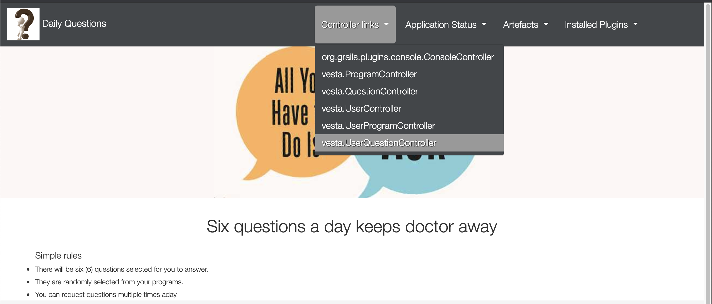

## Hello-Vesta-Quesitons

This is a little web app to exercise some basic random quesition fetching.

Essentially:
* one user can get up to 6 (reconfigurable) questions for a given day
* one user can request questions multiple times for a given day
* questions provided each time should not overlap with previously given questions for a given day
* questions are related to user via user enrolled programs

Basic domain models defined:
* [User](./grails-app/domain/vesta/User.groovy)
* [Program](./grails-app/domain/vesta/Program.groovy)
* [UserProgram](./grails-app/domain/vesta/UserProgram.groovy)
  users and programs have many to many relationship via this mapping table
* [Question](./grails-app/domain/vesta/Question.groovy)
  questions are grouped by programs
* [UserQuestionHistory](./grails-app/domain/vesta/UserQuestionHistory.groovy)
  this serves as a 'cache' table holding historically fetched questions that has been given to user, the timestamp in this table helps the deduping in the question fetching logic
  
Main question fetching logic is in [DailyQuestionServide](./grails-app/services/vesta/DailyQuestionService.groovy) service class.  

## how to run

Requires Oracle or OpenJDK 8.

First, clone repo to local disk:

```bash
./gradlew assemble -Dgrails.env=development
cd build/libs
java -jar ./hello-vesta-questions-0.1.jar
```

Then go to [localhost:8080](http://localhost:8080) and you will see a basic homepage that contains a list of controllers.

Web pages are used to represent question fetching and history list to illustrate the random and deduping logic.
The question fetch page url is [localhost:8080/userQuestion/index](http://localhost:8080/userQuestion/index)
See screenshot below:


## todos

- get question answering transaction implemented so answer timestamp can be recorded in history table
- ugly layout needs serious time...
- user login support (with security) to replace current hard-coded user setup
- a better text form for program and question CRUDs


## environment

This application is developed under:
- jdk: 8.0.242.hs-adpt
- grails: 4.0.2
- groovy: 2.5.x


## application setup

```bash
grails create-app hello-vesta-questions
```


